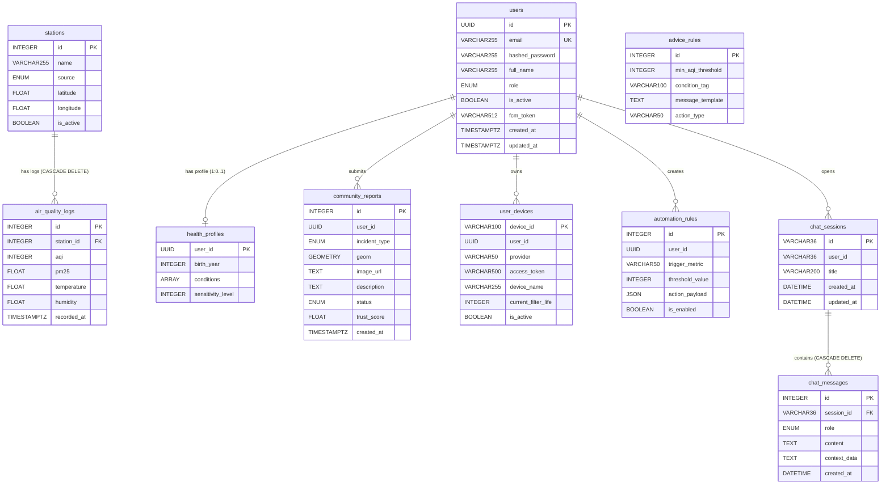

# AirShield — Database Schema Chi Tiết

> Phân tích từ `app/models/` — PostgreSQL 15 + PostGIS 3.4  
> Cập nhật: 2026-04-26

---

## 1. TỔNG QUAN DATABASE

| Thống kê | Giá trị |
|----------|---------|
| Số tables | **10** |
| Database engine | PostgreSQL 15 |
| Spatial extension | PostGIS 3.4 (cho `community_reports.geom`) |
| UUID strategy | `uuid4()` (Python-generated, không dùng `gen_random_uuid()`) |
| Timezone | `DateTime(timezone=True)` — lưu UTC |
| ORM | SQLAlchemy 2.x (Mapped + mapped_column style) |

**Danh sách tables:**

| Table | Module | Mô tả ngắn |
|-------|--------|-----------|
| `users` | Auth | Tài khoản người dùng |
| `stations` | AQS | Trạm đo chất lượng không khí |
| `air_quality_logs` | AQS | Bản ghi đo AQI theo thời gian |
| `health_profiles` | DPS | Hồ sơ sức khoẻ cá nhân |
| `advice_rules` | DPS | Quy tắc tư vấn sức khoẻ |
| `community_reports` | CGS | Báo cáo ô nhiễm từ cộng đồng |
| `user_devices` | SHA | Thiết bị IoT của người dùng |
| `automation_rules` | SHA | Quy tắc tự động hoá smart home |
| `chat_sessions` | ACB | Phiên hội thoại chatbot |
| `chat_messages` | ACB | Tin nhắn trong phiên chat |

---

## 2. CHI TIẾT TỪNG TABLE

### 2.1 Table: `users`

**Module:** Auth | **File:** `app/models/user.py`

| Column | Type | Constraints | Default | Mô tả |
|--------|------|-------------|---------|-------|
| `id` | `UUID` | PK, NOT NULL | `uuid4()` | Khóa chính (UUID v4) |
| `email` | `VARCHAR(255)` | UNIQUE, NOT NULL, INDEX | — | Địa chỉ email đăng nhập |
| `hashed_password` | `VARCHAR(255)` | NOT NULL | — | Password băm bcrypt |
| `full_name` | `VARCHAR(255)` | NULL | `NULL` | Họ tên đầy đủ |
| `role` | `ENUM('user','admin')` | NOT NULL | `'user'` | Vai trò trong hệ thống |
| `is_active` | `BOOLEAN` | NOT NULL | `TRUE` | Trạng thái tài khoản |
| `fcm_token` | `VARCHAR(512)` | NULL | `NULL` | Firebase FCM token (push notification) |
| `created_at` | `TIMESTAMPTZ` | NOT NULL | `now()` | Thời điểm tạo tài khoản |
| `updated_at` | `TIMESTAMPTZ` | NOT NULL | `now()` | Thời điểm cập nhật cuối (ON UPDATE) |

**Enum `UserRole`:** `user` | `admin`

**Indexes:**
- `pk_users` — PRIMARY KEY (`id`)
- `ix_users_email` — UNIQUE INDEX (`email`) — tìm kiếm đăng nhập O(log n)

---

### 2.2 Table: `stations`

**Module:** AQS | **File:** `app/models/aqs.py`

| Column | Type | Constraints | Default | Mô tả |
|--------|------|-------------|---------|-------|
| `id` | `INTEGER` | PK, NOT NULL, AUTO_INCREMENT | — | Khóa chính tự tăng |
| `name` | `VARCHAR(255)` | NOT NULL | — | Tên trạm (vd: "Hà Nội") |
| `source` | `ENUM('iqair','pamair')` | NOT NULL | `'iqair'` | Nguồn dữ liệu |
| `latitude` | `FLOAT` | NOT NULL | — | Vĩ độ WGS84 |
| `longitude` | `FLOAT` | NOT NULL | — | Kinh độ WGS84 |
| `is_active` | `BOOLEAN` | NOT NULL | `TRUE` | Trạm đang hoạt động |

**Enum `StationSource`:** `iqair` | `pamair`

**Indexes:**
- `pk_stations` — PRIMARY KEY (`id`)

**Relationships:**
- `stations` 1 → N `air_quality_logs` (cascade delete)

---

### 2.3 Table: `air_quality_logs`

**Module:** AQS | **File:** `app/models/aqs.py`

| Column | Type | Constraints | Default | Mô tả |
|--------|------|-------------|---------|-------|
| `id` | `INTEGER` | PK, NOT NULL, AUTO_INCREMENT | — | Khóa chính tự tăng |
| `station_id` | `INTEGER` | FK → `stations.id` ON DELETE CASCADE, NOT NULL | — | Trạm đo liên quan |
| `aqi` | `INTEGER` | NOT NULL | — | Chỉ số AQI (US standard, 0–500) |
| `pm25` | `FLOAT` | NULL | `NULL` | Nồng độ PM2.5 (µg/m³) |
| `temperature` | `FLOAT` | NULL | `NULL` | Nhiệt độ (°C) |
| `humidity` | `FLOAT` | NULL | `NULL` | Độ ẩm (%) |
| `recorded_at` | `TIMESTAMPTZ` | NOT NULL | `now()` | Thời điểm đo |

**Indexes:**
- `pk_air_quality_logs` — PRIMARY KEY (`id`)
- `ix_air_quality_logs_station_recorded` — COMPOSITE INDEX (`station_id`, `recorded_at`) — tối ưu query lịch sử theo trạm và khoảng thời gian

**Foreign Keys:**
- `fk_air_quality_logs_station_id_stations` — `station_id` → `stations.id` ON DELETE CASCADE

---

### 2.4 Table: `health_profiles`

**Module:** DPS | **File:** `app/models/dps.py`

| Column | Type | Constraints | Default | Mô tả |
|--------|------|-------------|---------|-------|
| `user_id` | `UUID` | PK, NOT NULL | `uuid4()` | Khóa chính = user_id (1-1 với users) |
| `birth_year` | `INTEGER` | NULL | `NULL` | Năm sinh (để tính tuổi) |
| `conditions` | `VARCHAR(100)[]` | NULL | `[]` | Mảng bệnh lý: `asthma`, `copd`, `heart_disease`, `sinus`, `allergies` |
| `sensitivity_level` | `INTEGER` | NOT NULL | `3` | Mức độ nhạy cảm: 1 (thấp) → 5 (cao) |

> **Lưu ý:** `conditions` dùng PostgreSQL `ARRAY` type — không cần bảng join riêng cho multi-value. Đây là thiết kế denormalized phù hợp với trường hợp số lượng bệnh lý cố định.

**Indexes:**
- `pk_health_profiles` — PRIMARY KEY (`user_id`)

**Quan hệ (logic, không có FK cứng):**
- Implicit 1-1 với `users.id` qua `user_id` UUID

---

### 2.5 Table: `advice_rules`

**Module:** DPS | **File:** `app/models/dps.py`

| Column | Type | Constraints | Default | Mô tả |
|--------|------|-------------|---------|-------|
| `id` | `INTEGER` | PK, NOT NULL, AUTO_INCREMENT | — | Khóa chính |
| `min_aqi_threshold` | `INTEGER` | NOT NULL | — | Ngưỡng AQI tối thiểu kích hoạt rule |
| `condition_tag` | `VARCHAR(100)` | NULL | `NULL` | Tag bệnh lý (`NULL` = áp dụng tất cả người dùng) |
| `message_template` | `TEXT` | NOT NULL | — | Template thông điệp (hỗ trợ `{placeholder}`) |
| `action_type` | `VARCHAR(50)` | NOT NULL | `'info'` | Loại hành động: `info`, `warning`, `alert`, `emergency` |

**Indexes:**
- `pk_advice_rules` — PRIMARY KEY (`id`)

**Ví dụ dữ liệu:**
| `min_aqi_threshold` | `condition_tag` | `action_type` | `message_template` |
|---------------------|----------------|---------------|-------------------|
| 101 | `NULL` | `warning` | `"AQI đang ở mức kém ({aqi}). Hạn chế hoạt động ngoài trời."` |
| 101 | `asthma` | `alert` | `"⚠️ Người bị hen suyễn: AQI={aqi} nguy hiểm. Dùng thuốc và ở trong nhà."` |

---

### 2.6 Table: `community_reports`

**Module:** CGS | **File:** `app/models/cgs.py`

| Column | Type | Constraints | Default | Mô tả |
|--------|------|-------------|---------|-------|
| `id` | `INTEGER` | PK, NOT NULL, AUTO_INCREMENT | — | Khóa chính |
| `user_id` | `UUID` | NOT NULL, INDEX | — | Người dùng gửi báo cáo |
| `incident_type` | `ENUM('burning','dust','smoke','chemical','other')` | NOT NULL | `'other'` | Loại sự cố ô nhiễm |
| `geom` | `GEOMETRY(POINT, 4326)` | NOT NULL | — | Vị trí địa lý PostGIS (WGS84) |
| `image_url` | `TEXT` | NULL | `NULL` | URL ảnh đính kèm |
| `description` | `TEXT` | NULL | `NULL` | Mô tả của người dùng |
| `status` | `ENUM('pending','verified','rejected')` | NOT NULL | `'pending'` | Trạng thái xác minh |
| `trust_score` | `FLOAT` | NOT NULL | `0.5` | Điểm tin cậy [0.0 – 1.0] |
| `created_at` | `TIMESTAMPTZ` | NOT NULL | `now()` | Thời điểm gửi |

**Enum `IncidentType`:** `burning` | `dust` | `smoke` | `chemical` | `other`  
**Enum `ReportStatus`:** `pending` | `verified` | `rejected`

**Indexes:**
- `pk_community_reports` — PRIMARY KEY (`id`)
- `ix_community_reports_user_id` — INDEX (`user_id`) — lọc theo người dùng
- PostGIS tự động tạo GIST index trên `geom` khi dùng GeoAlchemy2

**Cột đặc biệt — `geom`:**
```sql
-- Cách insert (Python → PostGIS):
ST_SetSRID(ST_MakePoint(longitude, latitude), 4326)

-- Cách extract (PostGIS → Python):
ST_X(geom) AS longitude, ST_Y(geom) AS latitude
```

---

### 2.7 Table: `user_devices`

**Module:** SHA | **File:** `app/models/sha.py`

| Column | Type | Constraints | Default | Mô tả |
|--------|------|-------------|---------|-------|
| `device_id` | `VARCHAR(100)` | PK, NOT NULL | — | ID thiết bị duy nhất (vd: `"xiaomi.air.p3"`) |
| `user_id` | `UUID` | NOT NULL, INDEX | — | Chủ sở hữu thiết bị |
| `provider` | `VARCHAR(50)` | NOT NULL | — | Nhà cung cấp: `tuya`, `xiaomi`, `samsung`, `philips`, `dyson` |
| `access_token` | `VARCHAR(500)` | NULL | `NULL` | OAuth token cho thiết bị API |
| `device_name` | `VARCHAR(255)` | NOT NULL | `'Air Purifier'` | Tên thiết bị (người dùng đặt) |
| `current_filter_life` | `INTEGER` | NULL | `100` | Tuổi thọ bộ lọc còn lại (0–100%) |
| `is_active` | `BOOLEAN` | NOT NULL | `TRUE` | Thiết bị còn hoạt động |

**Indexes:**
- `pk_user_devices` — PRIMARY KEY (`device_id`)
- `ix_user_devices_user_id` — INDEX (`user_id`) — liệt kê thiết bị theo user

---

### 2.8 Table: `automation_rules`

**Module:** SHA | **File:** `app/models/sha.py`

| Column | Type | Constraints | Default | Mô tả |
|--------|------|-------------|---------|-------|
| `id` | `INTEGER` | PK, NOT NULL, AUTO_INCREMENT | — | Khóa chính |
| `user_id` | `UUID` | NOT NULL, INDEX | — | Người dùng tạo rule |
| `trigger_metric` | `VARCHAR(50)` | NOT NULL | — | Chỉ số kích hoạt: `outdoor_aqi`, `indoor_aqi`, `pm25` |
| `threshold_value` | `INTEGER` | NOT NULL | — | Ngưỡng kích hoạt (vd: `150`) |
| `action_payload` | `JSON` | NOT NULL | — | Hành động thực hiện (JSON) |
| `is_enabled` | `BOOLEAN` | NOT NULL | `TRUE` | Rule đang được bật |

**Ví dụ `action_payload`:**
```json
{"power": "on", "mode": "turbo"}
{"power": "off"}
{"speed": 3, "mode": "auto"}
```

**Indexes:**
- `pk_automation_rules` — PRIMARY KEY (`id`)
- `ix_automation_rules_user_id` — INDEX (`user_id`) — lọc rules theo user

---

### 2.9 Table: `chat_sessions`

**Module:** ACB | **File:** `app/models/chatbot.py`

> ⚠️ Table được định nghĩa trong DB nhưng **chatbot service thực tế dùng Redis** để lưu sessions (key: `chat_session:{uuid}`, TTL 24h). Table này tồn tại cho mục đích audit/persistence lâu dài.

| Column | Type | Constraints | Default | Mô tả |
|--------|------|-------------|---------|-------|
| `id` | `VARCHAR(36)` | PK, NOT NULL | — | Session ID (UUID string) |
| `user_id` | `VARCHAR(36)` | NOT NULL, INDEX | — | Chủ sở hữu session |
| `title` | `VARCHAR(200)` | NULL | `NULL` | Tiêu đề tự động từ tin nhắn đầu |
| `created_at` | `DATETIME` | NOT NULL | `now()` | Thời điểm tạo |
| `updated_at` | `DATETIME` | NOT NULL | `now()` | Thời điểm cập nhật (ON UPDATE) |

**Indexes:**
- `pk_chat_sessions` — PRIMARY KEY (`id`)
- `ix_chat_sessions_user_id` — INDEX (`user_id`)

---

### 2.10 Table: `chat_messages`

**Module:** ACB | **File:** `app/models/chatbot.py`

| Column | Type | Constraints | Default | Mô tả |
|--------|------|-------------|---------|-------|
| `id` | `INTEGER` | PK, NOT NULL, AUTO_INCREMENT | — | Khóa chính |
| `session_id` | `VARCHAR(36)` | FK → `chat_sessions.id`, NOT NULL | — | Session chứa tin nhắn |
| `role` | `ENUM('user','assistant','system')` | NOT NULL | — | Vai trò người gửi |
| `content` | `TEXT` | NOT NULL | — | Nội dung tin nhắn |
| `context_data` | `TEXT` | NULL | `NULL` | JSON context (AQI, location) khi gửi |
| `created_at` | `DATETIME` | NOT NULL | `now()` | Thời điểm gửi |

**Enum `MessageRole`:** `user` | `assistant` | `system`

**Indexes:**
- `pk_chat_messages` — PRIMARY KEY (`id`)
- `fk_chat_messages_session_id_chat_sessions` — FOREIGN KEY INDEX (`session_id`)

---

## 3. RELATIONSHIPS & FOREIGN KEYS

### 3.1 Tổng Hợp Quan Hệ

```
users (1) ──────────────────────── (1) health_profiles
  │                                         [user_id UUID — logic relationship, no FK constraint]
  │
users (1) ──────────────────────── (N) community_reports
  │                                         [user_id UUID — logic, no FK constraint]
  │
users (1) ──────────────────────── (N) user_devices
  │                                         [user_id UUID — logic, no FK constraint]
  │
users (1) ──────────────────────── (N) automation_rules
  │                                         [user_id UUID — logic, no FK constraint]
  │
users (1) ──────────────────────── (N) chat_sessions
                                          [user_id VARCHAR(36) — logic, no FK constraint]

stations (1) ───[FK CASCADE DELETE]─── (N) air_quality_logs
                                          [station_id → stations.id]

chat_sessions (1) ──[FK]──────────── (N) chat_messages
                                          [session_id → chat_sessions.id]
```

### 3.2 Bảng Foreign Keys Thực Tế (Có Constraint)

| Table | Column | References | ON DELETE |
|-------|--------|-----------|-----------|
| `air_quality_logs` | `station_id` | `stations.id` | CASCADE |
| `chat_messages` | `session_id` | `chat_sessions.id` | CASCADE (via ORM) |

> **Ghi chú thiết kế:** Hầu hết các quan hệ với `users` không có FK constraint cứng trong DB — chỉ là UUID reference. Đây là lựa chọn thiết kế để đơn giản hoá việc xoá user (không cần cascade phức tạp), và phù hợp với microservice pattern trong tương lai.

### 3.3 Cardinality Chi Tiết

| Quan hệ | Kiểu | Mô tả |
|---------|------|-------|
| `users` → `health_profiles` | **1 : 0..1** | Một user có tối đa 1 hồ sơ sức khoẻ (PK = user_id) |
| `users` → `community_reports` | **1 : 0..N** | Một user gửi nhiều báo cáo ô nhiễm |
| `users` → `user_devices` | **1 : 0..N** | Một user liên kết nhiều thiết bị IoT |
| `users` → `automation_rules` | **1 : 0..N** | Một user tạo nhiều quy tắc tự động |
| `users` → `chat_sessions` | **1 : 0..N** | Một user có nhiều phiên chat |
| `stations` → `air_quality_logs` | **1 : 0..N** | Một trạm ghi nhiều bản đo (cascade delete) |
| `chat_sessions` → `chat_messages` | **1 : 1..N** | Một phiên có nhiều tin nhắn (cascade delete) |
| `advice_rules` (standalone) | **N/A** | Không liên kết trực tiếp — tra cứu theo `condition_tag` |

---

## 4. INDEXES & PERFORMANCE

### 4.1 Danh Sách Tất Cả Indexes

| Index Name | Table | Columns | Kiểu | Lý do |
|------------|-------|---------|------|-------|
| `pk_users` | `users` | `id` | PRIMARY | B-tree mặc định |
| `ix_users_email` | `users` | `email` | UNIQUE B-tree | Login lookup: `WHERE email = ?` |
| `pk_stations` | `stations` | `id` | PRIMARY | — |
| `pk_air_quality_logs` | `air_quality_logs` | `id` | PRIMARY | — |
| `ix_air_quality_logs_station_recorded` | `air_quality_logs` | `(station_id, recorded_at)` | **COMPOSITE B-tree** | Range query lịch sử theo trạm |
| `pk_health_profiles` | `health_profiles` | `user_id` | PRIMARY | Direct lookup by user |
| `pk_advice_rules` | `advice_rules` | `id` | PRIMARY | — |
| `pk_community_reports` | `community_reports` | `id` | PRIMARY | — |
| `ix_community_reports_user_id` | `community_reports` | `user_id` | B-tree | Lọc báo cáo theo user |
| *(PostGIS auto)* | `community_reports` | `geom` | **GIST** | Spatial queries (ST_DWithin, ST_Contains) |
| `pk_user_devices` | `user_devices` | `device_id` | PRIMARY | — |
| `ix_user_devices_user_id` | `user_devices` | `user_id` | B-tree | Liệt kê thiết bị theo user |
| `pk_automation_rules` | `automation_rules` | `id` | PRIMARY | — |
| `ix_automation_rules_user_id` | `automation_rules` | `user_id` | B-tree | Lọc rules theo user |
| `pk_chat_sessions` | `chat_sessions` | `id` | PRIMARY | — |
| `ix_chat_sessions_user_id` | `chat_sessions` | `user_id` | B-tree | Liệt kê sessions theo user |
| `pk_chat_messages` | `chat_messages` | `id` | PRIMARY | — |
| *(FK auto)* | `chat_messages` | `session_id` | B-tree | JOIN với chat_sessions |

### 4.2 Index Quan Trọng Nhất

**Composite Index `ix_air_quality_logs_station_recorded`:**

```sql
-- Query pattern được tối ưu:
SELECT * FROM air_quality_logs
WHERE station_id = 1
  AND recorded_at >= NOW() - INTERVAL '7 days'
ORDER BY recorded_at DESC;
-- Index cho phép: index scan trực tiếp, không cần full table scan
-- Đặc biệt quan trọng khi table có hàng triệu bản ghi (30 phút/lần × 5 thành phố × 365 ngày)
```

**GIST Index trên `geom` (PostGIS):**
```sql
-- Được dùng cho spatial query tìm trạm gần nhất:
SELECT *, ST_Distance(geom, ST_MakePoint(106.6, 10.8)::geography) AS dist
FROM stations ORDER BY dist LIMIT 1;
-- Không có GIST index → O(n) scan toàn bảng
```

---

## 5. ERD DIAGRAM (Mermaid)



---

## 6. SAMPLE DATA

### 6.1 `users`

```
id                                   | email                    | full_name    | role  | is_active | created_at
-------------------------------------|--------------------------|--------------|-------|-----------|----------------------------
550e8400-e29b-41d4-a716-446655440000 | nguyenvana@gmail.com     | Nguyễn Văn A | user  | true      | 2024-01-15 08:30:00+07
7c9e6679-7425-40de-944b-e07fc1f90ae7 | admin@airshield.vn       | Admin System | admin | true      | 2024-01-01 00:00:00+07
```

### 6.2 `stations`

```
id | name                     | source | latitude  | longitude  | is_active
---|--------------------------|--------|-----------|------------|----------
1  | Hà Nội                   | iqair  | 21.028500 | 105.854200 | true
2  | TP. Hồ Chí Minh          | iqair  | 10.823100 | 106.629700 | true
```

### 6.3 `air_quality_logs`

```
id   | station_id | aqi | pm25  | temperature | humidity | recorded_at
-----|------------|-----|-------|-------------|----------|----------------------------
1001 | 1          | 85  | 35.5  | 28.5        | 72.0     | 2024-01-15 08:00:00+07
1002 | 1          | 92  | 38.2  | 29.1        | 68.0     | 2024-01-15 08:30:00+07
```

### 6.4 `health_profiles`

```
user_id                              | birth_year | conditions               | sensitivity_level
-------------------------------------|------------|--------------------------|------------------
550e8400-e29b-41d4-a716-446655440000 | 1990       | {asthma,allergies}       | 4
7c9e6679-7425-40de-944b-e07fc1f90ae7 | 1985       | {}                       | 3
```

### 6.5 `advice_rules`

```
id | min_aqi_threshold | condition_tag | action_type | message_template
---|-------------------|---------------|-------------|---------------------------------------------------
1  | 101               | NULL          | warning     | AQI đang ở mức kém ({aqi}). Hạn chế hoạt động ngoài trời.
2  | 101               | asthma        | alert       | ⚠️ Người bị hen suyễn: AQI={aqi} nguy hiểm. Dùng thuốc hít và ở trong nhà.
```

### 6.6 `community_reports`

```
id | user_id     | incident_type | status  | trust_score | created_at
---|-------------|---------------|---------|-------------|----------------------------
1  | 550e8400... | burning       | pending | 0.50        | 2024-01-15 09:15:00+07
2  | 550e8400... | dust          | verified| 0.70        | 2024-01-14 14:30:00+07
   (geom: ST_MakePoint(106.68, 10.76) — Q7, TP.HCM)
```

### 6.7 `user_devices`

```
device_id      | user_id     | provider | device_name                        | current_filter_life | is_active
---------------|-------------|----------|------------------------------------|---------------------|----------
xiaomi_ab1234  | 550e8400... | tuya     | Xiaomi Air Purifier - Phòng khách  | 78                  | true
samsung_cd5678 | 550e8400... | tuya     | Samsung Air Purifier - Phòng ngủ   | 45                  | true
```

### 6.8 `automation_rules`

```
id | user_id     | trigger_metric | threshold_value | action_payload                        | is_enabled
---|-------------|----------------|-----------------|---------------------------------------|----------
1  | 550e8400... | outdoor_aqi    | 150             | {"power": "on", "mode": "turbo"}      | true
2  | 550e8400... | outdoor_aqi    | 50              | {"power": "off"}                      | true
```

### 6.9 `chat_sessions`

```
id                                   | user_id     | title                           | created_at
-------------------------------------|-------------|---------------------------------|----------------------------
a1b2c3d4-e5f6-7890-abcd-ef1234567890 | 550e8400... | Hỏi về AQI Hà Nội hôm nay      | 2024-01-15 10:00:00
b2c3d4e5-f6a7-8901-bcde-f12345678901 | 550e8400... | Cách bật máy lọc không khí      | 2024-01-15 11:30:00
```

### 6.10 `chat_messages`

```
id | session_id  | role      | content                                          | created_at
---|-------------|-----------|--------------------------------------------------|----------------------------
1  | a1b2c3d4... | user      | AQI Hà Nội hôm nay là bao nhiêu?               | 2024-01-15 10:00:05
2  | a1b2c3d4... | assistant | Hiện tại AQI tại Hà Nội là 85 (mức Trung bình). | 2024-01-15 10:00:07
```

---

## 7. DDL SQL (Tham Khảo)

> SQLAlchemy tự sinh DDL từ model definitions. Dưới đây là SQL tương đương.

```sql
-- Extension PostGIS (chạy một lần)
CREATE EXTENSION IF NOT EXISTS postgis;

-- users
CREATE TABLE users (
    id          UUID PRIMARY KEY DEFAULT gen_random_uuid(),
    email       VARCHAR(255) UNIQUE NOT NULL,
    hashed_password VARCHAR(255) NOT NULL,
    full_name   VARCHAR(255),
    role        VARCHAR(10) NOT NULL DEFAULT 'user' CHECK (role IN ('user','admin')),
    is_active   BOOLEAN NOT NULL DEFAULT TRUE,
    fcm_token   VARCHAR(512),
    created_at  TIMESTAMPTZ NOT NULL DEFAULT NOW(),
    updated_at  TIMESTAMPTZ NOT NULL DEFAULT NOW()
);
CREATE INDEX ix_users_email ON users(email);

-- stations
CREATE TABLE stations (
    id         SERIAL PRIMARY KEY,
    name       VARCHAR(255) NOT NULL,
    source     VARCHAR(10) NOT NULL DEFAULT 'iqair' CHECK (source IN ('iqair','pamair')),
    latitude   FLOAT NOT NULL,
    longitude  FLOAT NOT NULL,
    is_active  BOOLEAN NOT NULL DEFAULT TRUE
);

-- air_quality_logs
CREATE TABLE air_quality_logs (
    id          SERIAL PRIMARY KEY,
    station_id  INTEGER NOT NULL REFERENCES stations(id) ON DELETE CASCADE,
    aqi         INTEGER NOT NULL,
    pm25        FLOAT,
    temperature FLOAT,
    humidity    FLOAT,
    recorded_at TIMESTAMPTZ NOT NULL DEFAULT NOW()
);
CREATE INDEX ix_air_quality_logs_station_recorded
    ON air_quality_logs(station_id, recorded_at);

-- health_profiles
CREATE TABLE health_profiles (
    user_id         UUID PRIMARY KEY,
    birth_year      INTEGER,
    conditions      VARCHAR(100)[],
    sensitivity_level INTEGER NOT NULL DEFAULT 3
);

-- advice_rules
CREATE TABLE advice_rules (
    id                  SERIAL PRIMARY KEY,
    min_aqi_threshold   INTEGER NOT NULL,
    condition_tag       VARCHAR(100),
    message_template    TEXT NOT NULL,
    action_type         VARCHAR(50) NOT NULL DEFAULT 'info'
);

-- community_reports
CREATE TABLE community_reports (
    id              SERIAL PRIMARY KEY,
    user_id         UUID NOT NULL,
    incident_type   VARCHAR(10) NOT NULL DEFAULT 'other',
    geom            GEOMETRY(POINT, 4326) NOT NULL,
    image_url       TEXT,
    description     TEXT,
    status          VARCHAR(10) NOT NULL DEFAULT 'pending',
    trust_score     FLOAT NOT NULL DEFAULT 0.5,
    created_at      TIMESTAMPTZ NOT NULL DEFAULT NOW()
);
CREATE INDEX ix_community_reports_user_id ON community_reports(user_id);
-- PostGIS GIST index (tự động khi tạo Geometry column):
CREATE INDEX ON community_reports USING GIST(geom);

-- user_devices
CREATE TABLE user_devices (
    device_id           VARCHAR(100) PRIMARY KEY,
    user_id             UUID NOT NULL,
    provider            VARCHAR(50) NOT NULL,
    access_token        VARCHAR(500),
    device_name         VARCHAR(255) NOT NULL DEFAULT 'Air Purifier',
    current_filter_life INTEGER DEFAULT 100,
    is_active           BOOLEAN NOT NULL DEFAULT TRUE
);
CREATE INDEX ix_user_devices_user_id ON user_devices(user_id);

-- automation_rules
CREATE TABLE automation_rules (
    id              SERIAL PRIMARY KEY,
    user_id         UUID NOT NULL,
    trigger_metric  VARCHAR(50) NOT NULL,
    threshold_value INTEGER NOT NULL,
    action_payload  JSONB NOT NULL,
    is_enabled      BOOLEAN NOT NULL DEFAULT TRUE
);
CREATE INDEX ix_automation_rules_user_id ON automation_rules(user_id);

-- chat_sessions
CREATE TABLE chat_sessions (
    id         VARCHAR(36) PRIMARY KEY,
    user_id    VARCHAR(36) NOT NULL,
    title      VARCHAR(200),
    created_at TIMESTAMP NOT NULL DEFAULT NOW(),
    updated_at TIMESTAMP NOT NULL DEFAULT NOW()
);
CREATE INDEX ix_chat_sessions_user_id ON chat_sessions(user_id);

-- chat_messages
CREATE TABLE chat_messages (
    id           SERIAL PRIMARY KEY,
    session_id   VARCHAR(36) NOT NULL REFERENCES chat_sessions(id),
    role         VARCHAR(10) NOT NULL CHECK (role IN ('user','assistant','system')),
    content      TEXT NOT NULL,
    context_data TEXT,
    created_at   TIMESTAMP NOT NULL DEFAULT NOW()
);
```

---

*File này được tạo từ phân tích trực tiếp `app/models/*.py` — 2026-04-26*
